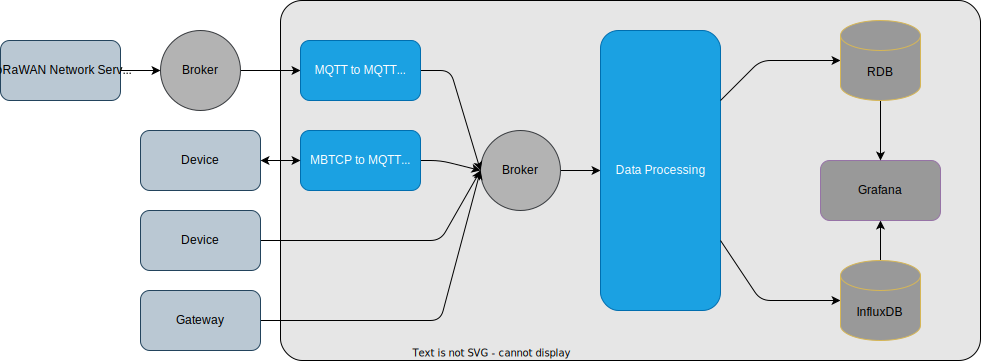

:raspberry-pi-getting-started: footnote:[link:https://www.raspberrypi.com/documentation/computers/getting-started.html[Getting started with your Raspberry Pi]]
:waveshare-cm4-eth-rs485-base-b: footnote:[link:https://www.waveshare.com/wiki/CM4-ETH-RS485-BASE-B[Waveshare CM4-ETH-RS485-BASE-B]]
= IoT 디바이스에서 수집된 데이터를 실시간으로 수집, 처리, 저장 및 시각화하는 완전한 IoT 플랫폼 구축
:modbus: footnote:[link:https://modbus.org/[modbus.org -> Technical Resources -> Modbus Specifications]]

**IoT 디바이스에서 수집된 데이터를 실시간으로 수집, 처리, 저장 및 시각화하는 완전한 IoT 플랫폼**을 구축하기 위한 요구 사항을 정리해 보겠습니다. 이 프로젝트는 다양한 IoT 디바이스에서 데이터를 실시간으로 수집하고, 이를 처리 및 분석하여 적절한 데이터베이스에 저장한 후, 최종적으로 시각화하는 과정을 포함합니다. 또한, 시스템 안정성, 확장성, 데이터 보안 등도 고려해야 합니다.

다음은 **하드웨어**, **소프트웨어**, **네트워크 구성**, **데이터 수집 및 처리** 등과 관련된 요구 사항을 세부적으로 설명한 내용입니다.

---

== 1. 하드웨어 요구 사항

=== 1.1 IoT 디바이스

데이터 수집 가능한 센서는 아래와 같습니다.

* 센서 종류
** 온도/습도
** CO2
** 조도
** 소음
** TVOC(총휘발성유기화합물)
** 문열림
** 재실 카운터
** 피플 카운
** 전력(전압, 전류, 역률 등)
* 접근 방법
** MQTT Broker를 통해 수신 가능
** MODBUS/TCP{modbus}를 이용해 읽어 오기

=== 1.2 네트워크
* 캠퍼스 내부망

=== 1.3 서버
* Raspberry PI CM4{raspberry-pi-getting-started} + Waveshare CM4-ETH-RS485-BASE-B{waveshare-cm4-eth-rs485-base-b}

=== 2. 소프트웨어 요구 사항

다음은 구성 예를 나타낸 것입니다.

==== 2.1 오픈 소스 소프트웨어를 활용한 구성

* 오픈 소스 소프트웨어를 활용해 IoT 서비스 플랫폼을 구성합니다.

==== 2.1.1 데이터 수집

* 제공 데이터
** 캠퍼스 환경 데이터를 MQTT를 통해 제공됩니다.
** 캠퍼스내 전력 사용량을 MODBUS/TCP를 통해 제공됩니다.

==== 2.2.2 데이터 처리

* MQTT로 제공되는 데이터는 토픽과 메시지를 통해 위치, 종류등이 확인 가능합니다.
** 이를 분석하여 자료로 만들 수 있습니다.
* MODBUS/TCP로 제공되는 데이터의 정보는별도의 자료로 제공됩니다.
** 자료를 통해 데이터의 위치와 종류를 확인할 수 있습니다.
* 데이터 중 불필요한 데이터를 제거하고, 유효한 데이터만 저장할 수 있도록 처리합니다.
* 처리를 위한 데이터는 여러 종류의 프로토콜을 이용해 획득 가능합니다.
** 데이터 수집 모듈이 별개의 프로그램으로 구성될 경우, 통일된 형태로 받도록 합니다.
** 예를 들어, 수집 모듈로 부터 MQTT를 이용해 수신 합니다.
** Node-RED의 기능을 대체할 프로그램을 작성합니다.
** Flow-based programming 기반의 데이터 처리 프로그램을 작성합니다.
** flow는 파일에 저정되고 실행시 로딩하여 실행됩니다.
* 필터링 및 변환
** 수집된 데이터를 실시간으로 필터링하거나 변환하여 저장합니다.
* 데이터 요약 및 집계
** 수집된 데이터를 요약(평균, 최대값, 최소값 등)하여 별도의 데이터베이스에 저장합니다.
* 이벤트 기반 처리
** 특정 이벤트가 발생했을 때 자동으로 대응하는 로직 구현합니다.

==== 2.2.3 데이터 저장

* 어떤 종류의 데이터베이스를 이용해도 됩니다.
** 하지만, 각 데이터베이스의 특성을 확인하고, 용도에 맞는 적절한 데이터베이스를 이용합니다.

==== 2.2.4 데이터 시각화 및 모니터링

* 수집되고 가공된 데이터를 볼 수 있도록 시각화 합니다.
* 다음 기능이 포함되어야 합니다.
** 실시간(지정한 실시간은 아니지만, 일정 시간내) 데이터를 표시합니다.
** 지정된 기간(1시간, 1일, 1주일, 1개월 등)의 통계 데이터를 출력합니다.
** 운영 현황을 출력합니다.
*** 데이터 수신율(시간당 몇개 등)
*** 에러율(디바이스별 데이터 누락, 센서 오류)

==== 2.2.4 시스템 부하 테스트
* 대규모 IoT 디바이스가 동시에 데이터를 전송할 때 시스템이 정상적으로 동작하는지 확인. 부하 테스트 도구를 사용하여 최대 트래픽을 처리할 수 있는 성능을 측정합니다.
** 부하 테스트를 위한 가상 장치를 개발하고, 이를 이용해 성능을 측정합니다.

==== 2.2.5 실시간 데이터 테스트
* 다양한 상황에서 실시간으로 데이터를 수집하고 처리할 때 시스템이 얼마나 빠르게 반응하는지 테스트합니다.
** 실시간 테스트를 위한 가상 장치를 개발하여 생성된 데이터를 적절히 가공해 의미 있는 자료로 만들어 지는지 확인합니다.
** 테스트용 실시간 데이트에 오류 데이터를 추가하여 오류에 대해 적절한 처리가 되는지 확인합니다.

==== 2.2 대체 가능한 소프트웨어 개발

2.1에서 구성한 서비스중 일부를 직접 개발한 소프트웨어로 대체할 수 있도록 합니다.

==== 2.2.6 설정 저장과 복구

* 각 프로그램의 설정은 별도의 파일 또는 데이터베이스에 저장합니다.
** 설정 파일은 json, yaml, toml 등 일반적으로 사용되는 형식을 적용합니다.

---

[cols="1a,1a,1a",grid=none,frame=none]
|===
<s|
^s|link:../../README.md[목차]
>s|
|===