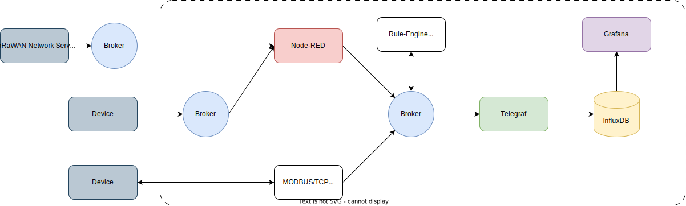

:raspberry-pi-getting-started: footnote:[link:https://www.raspberrypi.com/documentation/computers/getting-started.html[Getting started with your Raspberry Pi]]
:waveshare-cm4-eth-rs485-base-b: footnote:[link:https://www.waveshare.com/wiki/CM4-ETH-RS485-BASE-B[Waveshare CM4-ETH-RS485-BASE-B]]
= IoT 디바이스에서 수집된 데이터를 실시간으로 수집, 처리, 저장 및 시각화하는 완전한 IoT 플랫폼 구축
:modbus: footnote:[link:https://modbus.org/[modbus.org -> Technical Resources -> Modbus Specifications]]

**IoT 디바이스에서 수집된 데이터를 실시간으로 수집, 처리, 저장 및 시각화하는 완전한 IoT 플랫폼**을 구축하기 위한 요구 사항을 정리해 보겠습니다. 이 프로젝트는 다양한 IoT 디바이스에서 데이터를 실시간으로 수집하고, 이를 처리 및 분석하여 적절한 데이터베이스에 저장한 후, 최종적으로 시각화하는 과정을 포함합니다. 또한, 시스템 안정성, 확장성, 데이터 보안 등도 고려해야 합니다.

다음은 **하드웨어**, **소프트웨어**, **네트워크 구성**, **데이터 수집 및 처리** 등과 관련된 요구 사항을 세부적으로 설명한 내용입니다.

---

== 1. 하드웨어 요구 사항

=== 1.1 IoT 디바이스

데이터 수집 가능한 센서는 아래와 같습니다.

* 센서 종류
** 온도/습도
** CO2
** 조도
** 소음
** TVOC(총휘발성유기화합물)
** 문열림
** 재실 카운터
** 피플 카운
** 전력(전압, 전류, 역률 등)
* 접근 방법
** MQTT Broker를 통해 수신 가능
** MODBUS/TCP{modbus}를 이용해 읽어 오기

=== 1.2 네트워크
* 캠퍼스 내부망

=== 1.3 서버
* Raspberry PI CM4{raspberry-pi-getting-started} + Waveshare CM4-ETH-RS485-BASE-B{waveshare-cm4-eth-rs485-base-b}

=== 2. 소프트웨어 요구 사항

=== 2.1 데이터 수집

* MQTT Broker
** 실시간 메시징을 위해 MQTT를 이용하고, 브로커는 기존에 설치되어 있던 것을 사용합니다.
* MODBUS Agent
** MODBUS/TCP를 이용하고, 지정된 장치의 address map을 확인하여 필요한 정보만 요청해 얻어 옵니다.

=== 2.2 데이터 처리
* 데이터 처리 파이프라인: 수집된 데이터를 처리하고 변환할 수 있는 소프트웨어
** Node-RED: IoT 디바이스에서 수집된 데이터를 처리하고, 다양한 데이터베이스 및 애플리케이션으로 전달.
** Telegraf: 실시간 데이터 수집 및 변환을 위한 에이전트, InfluxDB와의 원활한 통합 제공.
** 데이터 처리 로직: 수집된 데이터를 필터링, 변환, 분석할 수 있는 로직 구현. 예: 온도가 일정 범위를 벗어나면 알림을 보내는 기능.

=== 2.3 데이터 저장
* 시계열 데이터베이스: 실시간으로 수집된 데이터를 저장할 데이터베이스.
** InfluxDB: 시계열 데이터를 저장하기 위한 데이터베이스. 높은 쓰기 성능을 제공하며, Grafana와의 원활한 통합 가능.
** SQL/NoSQL 데이터베이스: 비시계열 데이터는 MySQL, MongoDB 등의 데이터베이스에 저장할 수 있음.
* 데이터 보존 정책: 오래된 데이터를 자동으로 삭제하거나, 요약된 데이터를 저장하는 지속 쿼리 설정.

=== 2.4 데이터 시각화 및 모니터링
* Grafana: 실시간으로 수집된 데이터를 시각화하고 모니터링할 수 있는 대시보드 도구. 다양한 차트와 그래프를 통해 데이터를 직관적으로 표현할 수 있음.
* 경고 및 알림 시스템: Grafana와 같은 도구를 통해, 특정 조건에 도달하면 경고 메시지를 이메일, Slack, SMS 등으로 전송할 수 있는 시스템 설정.
** 예: 온도가 30°C를 초과하면 경고 알림을 전송.

== 3. 네트워크 및 통신 요구 사항

=== 3.1 통신 프로토콜
* MQTT: 경량 메시지 전송 프로토콜로, 실시간 데이터 전송에 적합. IoT 디바이스와 서버 간의 안정적인 통신을 지원.
* MODBUS/TCP: 산업 설비에서 가장 많이 사용되고 있는 프로토콜.
* **과제**: 기능 검증이 가능하도록 프로토콜별 가상 장치를 작성합니다.
** 개발된 가상 장치는 값 검증이 가능해야 합니다.
** MQTT, MODBUS/TCP 각각의 가상 장치를 개발합니다.
** 동작에 필요한 설정을 파일에서 읽어오도록 구성합니다.

=== 3.2 네트워크 연결
* Wi-Fi/Ethernet: IoT 디바이스가 로컬 네트워크에 연결되어 데이터를 전송합니다.

== 4. 데이터 처리 및 분석 요구 사항

=== 4.1 데이터 처리 로직
* 필터링 및 변환
** 수집된 데이터를 실시간으로 필터링하거나 변환하여 저장.
** 예: 온도 센서에서 수집된 데이터를 °F에서 °C로 변환.
* 데이터 요약 및 집계
** 수집된 데이터를 요약(평균, 최대값, 최소값 등)하여 저장.
** 이를 통해 대규모 데이터 저장 공간을 절약하고 성능을 최적화할 수 있음.
* 이벤트 기반 처리
** 특정 이벤트가 발생했을 때 자동으로 대응하는 로직 구현.
** 예: 특정 임계값을 초과할 경우 알림 전송 또는 장치 제어.

=== 4.2 실시간 데이터 분석
* 스트림 처리: 실시간 데이터를 처리하고 즉각적인 피드백을 제공하는 기능. 예: 실시간으로 온도 데이터를 분석하여 특정 조건이 발생하면 경고.
* 예측 분석: 과거 데이터를 기반으로 머신러닝 알고리즘을 적용해 미래의 상태를 예측. 예: 기계의 고장 가능성을 예측.

== 5. 테스트 및 검증 요구 사항

=== 5.1 시스템 부하 테스트
* 부하 테스트: 대규모 IoT 디바이스가 동시에 데이터를 전송할 때 시스템이 정상적으로 동작하는지 확인. 부하 테스트 도구를 사용하여 최대 트래픽을 처리할 수 있는 성능을 측정.

=== 5.2 실시간 데이터 테스트
* 실시간 테스트: 다양한 상황에서 실시간으로 데이터를 수집하고 처리할 때 시스템이 얼마나 빠르게 반응하는지 테스트.

== 6. 과제

1. 오픈 소스 소프트웨어를 이용해 전체 서비스를 구성합니다.
* Node-RED, MQTT Broker, Telegraf, InfluxDB, Grafana를 이용합니다.
* 각 프로그램은 Raspberry Pi에 Docker Compose를 이용해 실행합니다.
2. 서비스를 구성하는 일부 기능을 자바로 구현하여, 동일하게 동작하는지 확인합니다.
* 데이터 수집
** MODBUS/TCP 에이전트를 개발하고 MODBUS/TCP 장치에서 데이터를 읽어와 MQTT 프로토콜로 변환하여 내부 브로커에게 전달합니다.
* 데이터 처리
** Node-RED의 기능을 대체할 프로그램을 작성합니다.
** Flow-based programming 기반의 데이터 처리 프로그램을 작성합니다.
** flow는 파일에 저정되고 실행시 로딩하여 실행됩니다.
* 테스트 및 검증
** 부하 테스트를 위한 가상 장치를 개발합니다.
** 실시간 테스트를 위한 가상 장치를 개발합니다.

---

[cols="1a,1a,1a",grid=none,frame=none]
|===
<s|
^s|link:../../README.md[목차]
>s|
|===